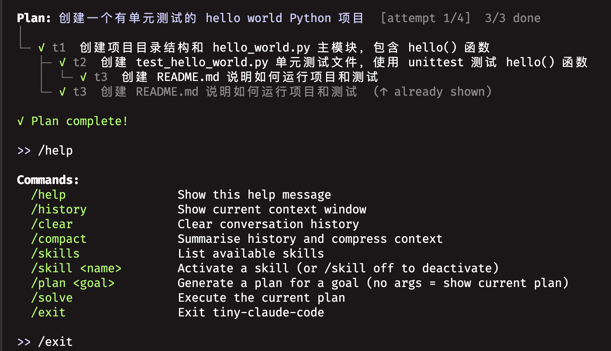

# tiny-claude-code




A minimal, fully functional coding assistant CLI built from scratch — a simplified reimplementation of [Claude Code](https://docs.anthropic.com/en/docs/claude-code/overview).

---

## Features

| Feature | Description |
|---|---|
| **Streaming REPL** | Real-time streamed responses with token usage display |
| **Tool use loop** | Agent autonomously calls tools (read, write, edit, bash, …) until the task is done |
| **Permission system** | Every write/execute action requires confirmation; `always` whitelists an entire tool class for the session |
| **Context compression** | Three-layer strategy: proactive threshold, reactive 400-retry, and `/compact` — enables indefinitely long sessions |
| **@file injection** | Type `@path/to/file` anywhere in a prompt to inline the file content |
| **Skill system** | Activate reusable prompt personas (`/skill review`, `/skill test`, …) that steer every subsequent message |
| **Planning & solving** | `/plan <goal>` generates a DAG of tasks; `/solve` executes them with parallel subagents |
| **Parallel subagents** | Independent tasks (per DAG analysis) run concurrently in threads with isolated history; only a batch summary is appended to the main context |
| **Cross-platform bash** | Detects macOS / Linux / Windows and dispatches to the correct shell |
| **Proxy compatible** | Stores history as plain text — no `tool_use` / `tool_result` blocks — so any Anthropic-compatible API works |

---

## Architecture

```
tiny-claude-code/
├── main.py          # REPL loop: input → skill inject → agent → display
├── config.py        # Model, token thresholds, paths (reads from .env)
│
├── agent/           # Core API layer
│   └── __init__.py  #   streaming call, tool dispatch, auto-compact (3-layer)
│
├── tools/           # Tool implementations
│   ├── __init__.py  #   tool registry: TOOLS (JSON schema) + TOOL_HANDLERS
│   ├── bash.py      #   shell execution, OS detection, blocklist
│   └── filesystem.py#   read/write/edit/delete/mkdir/cd — sandboxed to cwd
│
├── plan/            # Planning & parallel solving
│   └── __init__.py  #   Task/Plan dataclasses, DAG scheduling,
│                    #   ThreadPoolExecutor, per-thread stdout capture,
│                    #   batch summarisation
│
├── commands/        # Slash commands (/help /plan /solve /skill …)
├── context/         # @file expansion + skill loading (YAML frontmatter)
├── permissions/     # Allow / deny / always prompt
├── ui/              # ANSI colour helpers, history display, readline fix
└── skills/          # Skill definition files (Markdown + YAML frontmatter)
    ├── review.md
    ├── explain.md
    └── test.md
```

### Agent loop

```
user input
    │
    ▼
resolve @file refs ──► inject active skill prompt
    │
    ▼
agent_loop(history)
    │
    └── while stop_reason == "tool_use":
            check permission → execute tool → append result
    │
    ▼
display response + token stats
```

### Parallel planning

```
/plan <goal>  ──► Claude generates DAG (JSON)  ──► display tree

/solve
    │
    └── while not complete:
            ready = tasks whose deps are all done
            │
            ├── run ready tasks in parallel (ThreadPoolExecutor)
            │       each thread: isolated history copy + captured stdout
            │
            └── append ONE batch summary to main history
```

---

## Quick start

```bash
# 1. Install dependencies
pip install -r requirements.txt

# 2. Configure
cp .env.example .env
# edit .env — set ANTHROPIC_API_KEY and MODEL_ID

# 3. Run
python main.py

# Optional: point at a project directory
python main.py --dir /path/to/project
```

## Slash commands

```
/help            Show all commands
/history         Show conversation context window
/clear           Clear history
/compact         Summarise and compress context (manual)
/skills          List available skills
/skill <name>    Activate a skill  (review | explain | test)
/skill off       Deactivate skill
/plan <goal>     Generate a task plan
/plan            Show current plan
/solve           Execute the current plan
/exit            Quit
```

## Configuration (`.env`)

```bash
ANTHROPIC_API_KEY=sk-ant-...
MODEL_ID=claude-sonnet-4-6

# Optional: use any Anthropic-compatible provider
# ANTHROPIC_BASE_URL=https://api.deepseek.com/anthropic
# MODEL_ID=deepseek-chat
```

## Adding skills

Create a Markdown file in `skills/` with YAML frontmatter:

```markdown
---
name: refactor
description: Refactor code for clarity and performance
---

You are performing a focused refactor. For each piece of code: ...
```

Then activate with `/skill refactor`.

---

## Tech stack

- **Python 3.11+**
- [anthropic-sdk-python](https://github.com/anthropics/anthropic-sdk-python) — streaming Messages API
- `concurrent.futures.ThreadPoolExecutor` — parallel subagent execution
- `threading.local` — per-thread stdout isolation
- `readline` — line editing with ANSI cursor fix (`\001…\002`)
- No web framework, no database, no external state
